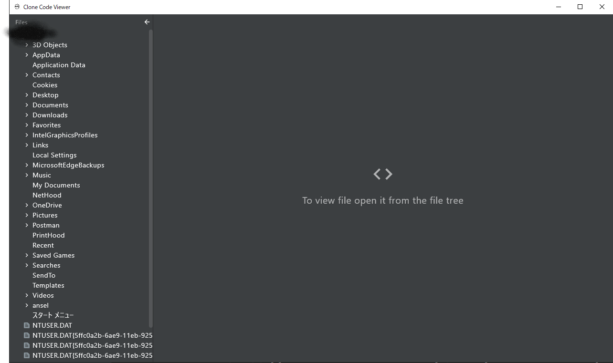

# CloneCodeViewer
Jetpack Compose For Desktopのサンプルアプリを写経してCloneしました。
元はマルチプラットフォーム対応でしたが、クローンにするにあたってデスクトップアプリ専用に一部修正しました。

# 環境
IDE:IntelliJ

JDK:Corretto-11.0.3.7.1

# 実行(WINDOWS)
``
gradlew.bat run
``

# 実行(Linux)
``
./gradlew run
``

